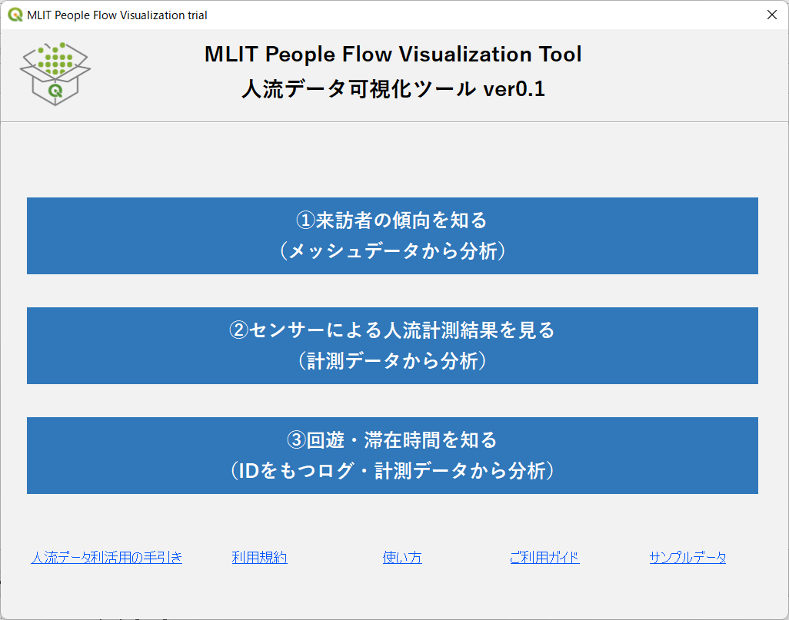
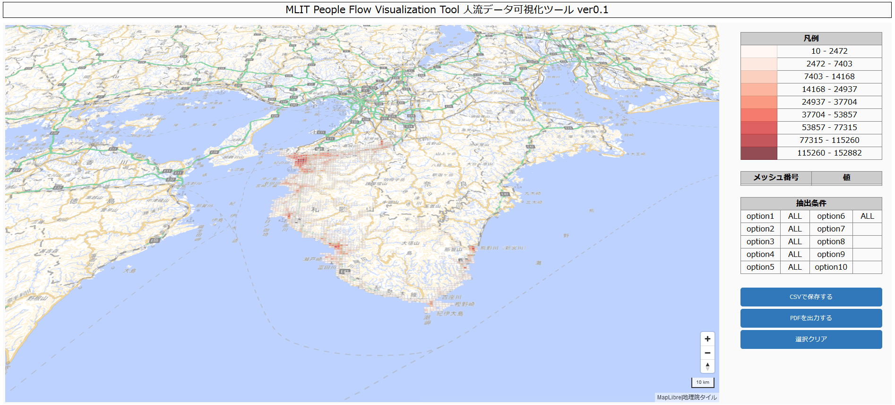

「人流データ可視化ツール (MLIT People Flow Visualization Tool)」
====

「人流データ可視化ツール(MLIT People Flow Visualization Tool)」（以下、本ツール）は国土交通省不動産・建設経済局情報推進課にて実施した 令和４年度人流データの可視化等検討調査業務 において試作開発したものです。
本ツールは人流データの利活用促進のために、これまで GISや BIツール等で人流データを取り扱ったことのないユーザーに向けて、人流データの活用に取り組むきっかけとなることを狙って試作開発したものです。このため、本ツールは人流データの可視化においてよく使われる表現に絞ってツールをパッケージ化し、できるだけ簡易に可視化できるようにしております。

# 画面イメージ

# 動作環境
本ツールはQGIS 3.22にて動作確認をしております。
##  

# 利用方法
利用方法については、[使い方](document/howtouse.pdf)をご確認ください。
##  

# 利用ライブラリ等
- 分析結果を表示する地図には[地理院タイル](https://www.gsi.go.jp/kikakuchousei/kikakuchousei40182.html)若しくは[CARTO basemap styles](https://github.com/CartoDB/basemap-styles)を利用しています。

- 世界メッシュコード関連関数(https://www.fttsus.org/worldgrids/ja/our_library/)
 
 「このライブラリは科学技術振興機構（JST)さきがけ「グローバル・システムの持続可能性評価基盤に関する研究」（[JPMJPR1504](https://projectdb.jst.go.jp/grant/JST-PROJECT-15655008/))およびJST未来社会創造事業「自律分散的世界メッシュ統計基盤アーキテクチャの設計と実証」([JPMJMI20B6](https://projectdb.jst.go.jp/grant/JST-PROJECT-20336716/))の研究成果です。本ライブラリは一般社団法人世界メッシュ研究所から提供されています。」

- MapLibre(https://maplibre.org/)
- D3.js(https://d3js.org/)
- deck.gl(https://deck.gl/)

##  

# ライセンス
このプロジェクトは GPLv2 ライセンスの元にライセンスされています。
[GPL-2.0](https://www.gnu.org/licenses/old-licenses/gpl-2.0.txt)

